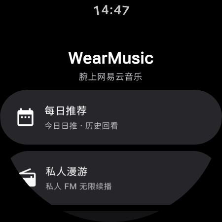
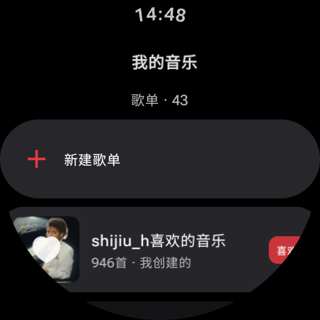
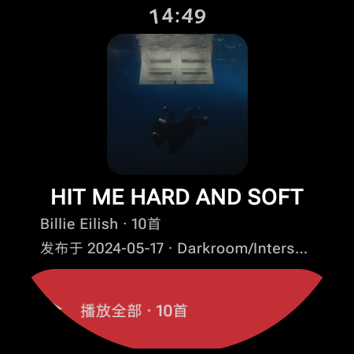
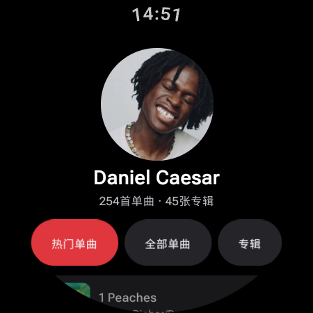
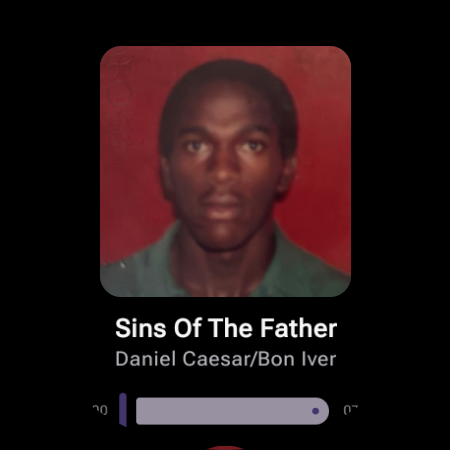
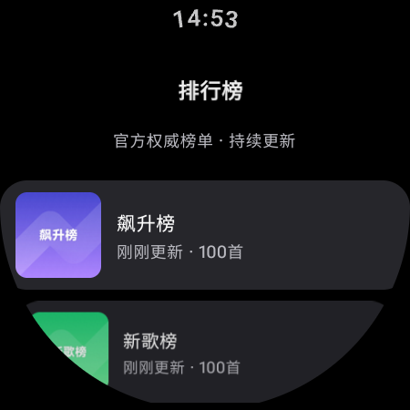
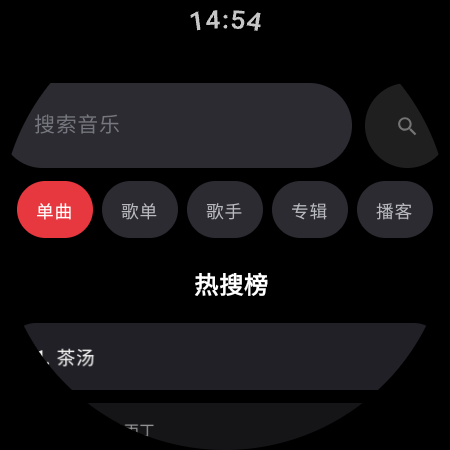

# WearMusic — Wear OS 网易云音乐播放器

一款为 **Wear OS（手表）** 打造的网易云音乐播放器，基于 Jetpack Compose for Wear OS + Media3 构建，
接入现成的网易云 API 网关模块（`core:netease`），支持在线播放、每日推荐、私人漫游、音乐云盘等完整功能。

## 界面预览

| 主界面 | 个人页 |
|:---:|:---:|
|  |  |
| **主界面** — 应用首页，提供每日推荐、私人漫游等核心功能入口 | **个人页** — 账号头像、昵称、UID 与黑胶 VIP 标识，下方为按账号等级动态展现的音质设置 |
|  |  |
| **我的歌单** — 我创建 / 收藏的全部歌单，支持新建歌单、管理歌曲 | **专辑页** — 专辑封面、歌手、发行时间与厂牌信息，点击封面查看详情，一键播放全部曲目 |
|  |  |
| **评论区** — 专辑 / 歌曲 / 歌单等的热门与最新评论，支持点赞与发表评论 | **歌手页** — 歌手头像与单曲 / 专辑数量，热门单曲、全部单曲、专辑分类浏览 |
|  |  |
| **播放页** — 大封面 + 当前曲目信息，播放 / 暂停 / 切歌、进度拖动与音量 | **歌词页** — 歌词逐行 / 逐字跟随滚动，支持翻译对照显示 |
|  |  |
| **榜单页** — 飙升榜、新歌榜等官方权威榜单，持续更新、即点即播 | **搜索页** — 单曲 / 歌单 / 歌手 / 专辑 / 播客五类搜索，热搜榜与本地搜索历史 |

## 功能总览

| 模块 | 功能 |
|---|---|
| 在线播放 | ExoPlayer 前台服务播放、播放/暂停/上下曲/拖动进度、逐行/逐字歌词、**后台自动连播**、系统媒体面板展示播放队列 |
| 播放音质 | 标准 128K / 较高 192K / 极高 320K / 无损 FLAC，**按账号黑胶 VIP 等级动态展现**（账号页设置） |
| 每日推荐 | 今日日推 + **历史日推**（最近 14 天任选日期） |
| 私人漫游 | 无限续播（队列尾部自动追加）、不感兴趣移除 |
| 心动模式 | 基于种子歌曲（当前播放 / 日推）+ 歌单智能推荐 |
| 雷达歌单 | 基于听歌口味聚合（需登录） |
| 推荐歌单 | 个性化推荐（未登录也可浏览） |
| 排行榜 | 全部官方榜单浏览与播放 |
| 搜索 | 单曲 / 歌单 / 歌手 / 专辑 / 播客 五类搜索 + 热搜 + 搜索建议 + 本地搜索历史 |
| 我的音乐 | 个人歌单 / 收藏专辑 / 收藏播客 |
| 歌单详情 | 播放、收藏/取消收藏、**隐私设置（设为隐私歌单）**、编辑歌单信息、删除歌单、创建歌单、收藏歌曲到歌单、心动模式入口 |
| 专辑详情 | 播放、收藏/取消收藏 |
| 播客详情 | 订阅/取消订阅、节目列表播放 |
| 歌手页 | 热门单曲 / 全部单曲（分页）/ 专辑列表 |
| 评论 | 歌曲 / 歌单 / 专辑 / 播客节目 / 电台评论查看、点赞、发表；热门/最新排序、分页加载 |
| 更多 | 清理缓存（图片/歌词/直链三层）、专辑封面点击查看专辑详情、关于页 |
| 听歌打卡 | 播放满 30 秒或过半自动向云端 `scrobble` 上报一次（每首歌去重） |

## 登录

支持三种方式（未登录也能以游客身份播放部分内容）：

1. **扫码登录**：手机网易云音乐 App 扫二维码，二维码生成后轮询扫码状态；
2. **手机号 + 密码**；
3. **手机号 + 短信验证码**。

登录态（cookie）持久化在本地，重启无需重新登录。也可在「账号」页选择**游客模式**直接体验。

## 构建与安装

### 环境要求

- JDK 17+
- Android SDK：compileSdk 36（platform `android-36`），minSdk 30 / targetSdk 34
- Gradle 8.9（Wrapper 已配置，国内走腾讯云镜像下载）

应用包名：`com.shijiu.wearmusic`。Release 签名使用 `keystore/wear-music.jks`
（别名 `wearmusic`，密码见 `app/build.gradle.kts`，仅供个人使用请勿外传）。

### 步骤

```bash
# 1. 配置 local.properties 指向你的 SDK
echo "sdk.dir=/path/to/android-sdk" > local.properties

# 2. 编译 Debug APK
./gradlew :app:assembleDebug

# 3. 安装到手表
adb install app/build/outputs/apk/debug/app-debug.apk
```

> 沙箱/内网环境若无法访问 `dl.google.com`，`settings.gradle.kts` 已默认配置
> 腾讯云 + 华为云 Maven 镜像，无需修改。

## 项目结构

```
WearMusic/
├── app/                          # Wear OS 应用
│   └── src/main/java/com/shijiu/wearmusic/
│       ├── WearApp.kt            # Application + 手动依赖注入（AppContainer）
│       ├── MainActivity.kt
│       ├── data/                 # 仓库层
│       │   ├── AccountRepository.kt   # 登录态 / 游客 / cookie 持久化 / VIP 等级
│       │   ├── MusicRepository.kt     # 全部业务数据门面（UiResult 统一返回）
│       │   ├── ExtraNeteaseApi.kt     # 补充接口：推荐歌单 / 雷达歌单 / 歌单隐私
│       │   └── AppPrefs.kt            # 音质档位(AudioQuality) / 搜索历史等本地偏好
│       ├── playback/
│       │   ├── PlaybackManager.kt     # 队列镜像 / 直链解析(8min TTL) / 预解析续播 / 打卡
│       │   └── PlaybackService.kt     # Media3 MediaSessionService 前台服务
│       └── ui/                   # Compose for Wear 界面（约 20 个屏幕，Material 3 Expressive）
│           ├── home/ player/ lyrics/ daily/ fm/ heart/
│           ├── lists/ cloud/ mine/ search/ account/ login/
│           ├── playlist/ album/ artist/ dj/ comments/ about/
│           └── components/       # SongRow / MediaRow / MenuDialog 等通用件
└── core/netease/                 # 网易云 API 模块（来自 OHMusic）
    └── src/main/java/com/ohmusic/app/data/
        ├── remote/NeteaseClient.kt    # OkHttp + cookie 注入 body + 业务码判定
        └── remote/api/                # 歌曲/搜索/歌单/专辑/歌手/播客/评论/云盘… 13 个 API 类
```

## 关键实现说明

- **API 网关**：所有请求走 `https://mymusic.rbook.site`，cookie 以 JSON body 的 `cookie` 字段注入
  （非 HTTP Header）；HTTP 恒为 200，业务码在 body 的 `code` 中（301/250 视为需要登录）。
- **直链播放**：每次播放实时换取歌曲 URL（有效期短，8 分钟 TTL 缓存）；CDN 要求
  `Referer: https://music.163.com/`，ExoPlayer 的 HttpDataSource 与 Coil 图片加载器均已注入。
- **播放队列镜像**：整个队列镜像为 ExoPlayer playlist，未播条目先挂占位 URI，
  距结束不足 20 秒（或切歌后）时实时解析并 `replaceMediaItem` 原位替换——
  后台播完一首自动续播不断流，系统媒体面板也能看到完整播放列表。
- **音质**：`/song/url` 的 `br` 参数（128000/192000/320000/999000），
  无损需黑胶 VIP；账号页的音质选项按账号 `vipType` 等级动态展现，切换后即时生效。
- **听歌打卡**：Ticker 每秒轮询进度，满足「≥30 秒或过半」即调用 `/scrobble` 上报，同一首歌去重。
- **私人漫游**：队列快耗尽时自动调用 FM 接口追加下一批，实现无限播放。
- **历史日推**：`/recommend/songs?date=YYYY-MM-DD` 支持最近 14 天（实测游客态也可用）。
- **歌单隐私**：网关存在 `/playlist/privacy?privacy=10|0` 接口（实测可用），用于设为隐私/公开。

## 已知限制

- **歌手评论**：网易云无官方「歌手页评论」端点，故歌手页不提供评论入口；歌曲 / 歌单 / 专辑 /
  播客节目 / 电台均可查看与发表评论。
- 部分无音源歌曲（VIP 或下架）会提示并自动跳过；连续 3 首失败自动停止播放。
- 播客节目的「歌曲评论」入口仅对该期节目内含歌曲时可用。

## 依赖

- Kotlin 2.1.0 / AGP 8.7.3 / Gradle 8.9
- Jetpack Compose for Wear OS **1.6.2（Material 3 Expressive）** + Compose BOM 2025.09.00
- Media3 1.4.1（ExoPlayer + MediaSessionService）
- Coil 2.7.0 / kotlinx-serialization 1.8.0 / OkHttp 4.12.0 / Coroutines 1.9.0
